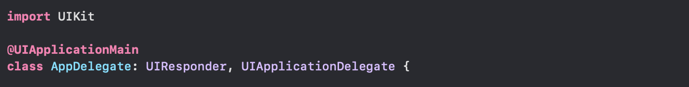

iOS 앱의 상태 변화에 따른 동작을 처리하는 App Delegate 메서드들이 있다.
이 메서드들과 함께 앱이 어떠한 실행과정을 거쳐서 AppDelegate를 생성하는지까지 알아보려한다.
내가 원하는 동작을 효과적으로 구현하기 위해서는 iOS와 UIKit 프레임워크가 어떻게 동작하는지 이해하는게 중요하다.

> UIApplicationMain에 대한 글
> UIApplication에 대한 글
> iOS App의 실행과정에 대한 글
> UIResponder에 대한 글
> SceneDelegate에 대한 글

## 🧩 iOS App의 실행과정
먼저 앱의 실행과정을 알아본다. 실행과정은 아래와 같다.

> 1. main 함수 실행
2. UIKit 프레임워크의 [UIApplicationMain(_ : _ : _ : _ :)](https://developer.apple.com/documentation/uikit/1622933-uiapplicationmain) 함수 실행
  - 1) [UIApplication](https://developer.apple.com/documentation/uikit/uiapplication) 싱글턴 객체 생성
  - 2) AppDelegate 객체와 연결(delegate 설정)
  - 3) [UIApplication](https://developer.apple.com/documentation/uikit/uiapplication) 객체가 info.plist 파일에서 앱 실행에 필요한 데이터와 객체 로드
  - 4) [UIApplication](https://developer.apple.com/documentation/uikit/uiapplication) 객체가 Main Event Loop를 생성하고 관리
  - 5) (Info.plist에 main storyboard 세팅된 경우) [UIApplication](https://developer.apple.com/documentation/uikit/uiapplication) 객체가 main NIB 파일에서 main UI 로드
3. AppDelegate의 [application(_:willFinishLaunchingWithOptions:)](https://developer.apple.com/documentation/uikit/uiapplicationdelegate/1623032-application) 호출
4. AppDelegate 및 ViewControllers의 추가 메서드를 호출하여 앱 상태 복원
5. AppDelegate의 [application(_:didFinishLaunchingWithOptions:)](https://developer.apple.com/documentation/uikit/uiapplicationdelegate/1622921-application) 호출
6. (Info.plist에 main storyboard 세팅되지 않은 경우) main UI 로드
7. 앱 이벤트 루프에서 이벤트 핸들링 시작
8. 앱 사용!

실행과정 플로우차트는 아래와 같다. 두 플로우차트의 차이점은 main UI를 어떤 시점에 로드하는가의 차이이다.
첫번째 플로우차트는 main UI를 [application(_:didFinishLaunchingWithOptions:)](https://developer.apple.com/documentation/uikit/uiapplicationdelegate/1622921-application)를 실행하는 시점에 로드하고, 두번째 플로우차트는 Info.plist에 main NIB을 세팅하여 [UIApplicationMain(_ : _ : _ : _ :)](https://developer.apple.com/documentation/uikit/1622933-uiapplicationmain) 함수가 main UI 로드를 실행해주게 된다.

 

   
   <em style="font-size: 0.7em;">출처: https://oleb.net/blog/2012/02/app-launch-sequence-ios-revisited/</em>

 

   
   <em style="font-size: 0.7em;">출처: https://stackoverflow.com/questions/17366107/what-is-the-launch-sequence-of-an-ios-app</em>

 

**이제 앱 실행과정을 하나씩 확인해본다.**
 

### 1. main 함수와 UIApplicationMain
swift에서는 main.m이 자동으로 생성되는 Objective-C와 다르게,
Appdelegate.swift의 @UIApplicationMain 어노테이션을 없애고 main.swift를 직접 생성하여 main 함수를 커스텀할 수 있다.

~~~ swift
import UIKit

UIApplicationMain(CommandLine.argc,
                  UnsafeMutableRawPointer(CommandLine.unsafeArgv).bindMemory(
                      to: UnsafeMutablePointer<Int8>.self,
                      capacity: Int(CommandLine.argc)),
                  nil,
                  NSStringFromClass(AppDelegate.self))
~~~

main 함수에서 실행되는 [UIApplicationMain(_ : _ : _ : _ :)](https://developer.apple.com/documentation/uikit/1622933-uiapplicationmain) 함수는 UIApplication 객체와 AppDelegate 객체를 생성하여 연결(delegate)하고 Main Event Loop를 세팅한다. Main Event Loop는 앱의 Run Loop를 포함하며 처리 이벤트를 시작한다.

공식문서에서 [UIApplicationMain(_ : _ : _ : _ :)](https://developer.apple.com/documentation/uikit/1622933-uiapplicationmain) 함수의 선언부분을 보면 아래와 같다.

   

3,4번째 파라미터인 principalClassName와 delegateClassName 는 각각 [UIApplication](https://developer.apple.com/documentation/uikit/uiapplication) 클래스 이름과 AppDelegate로 초기화될 클래스 이름이다.

 

### 2. UIApplication
[UIApplication](https://developer.apple.com/documentation/uikit/uiapplication)은 iOS에서 실행되는 앱을 위한 중앙화된 제어 및 조정 지점이라고 한다. 공식문서에서 [UIApplication](https://developer.apple.com/documentation/uikit/uiapplication)의 선언부분을 보면 아래와 같다.

   

[UIApplication](https://developer.apple.com/documentation/uikit/uiapplication)는 [UIResponder](https://developer.apple.com/documentation/uikit/uiresponder) 클래스를 상속받는데, [UIResponder](https://developer.apple.com/documentation/uikit/uiresponder) 클래스는 이벤트에 반응하여 처리해주기 위한 목적의 추상 인터페이스이다.
[UIResponder](https://developer.apple.com/documentation/uikit/uiresponder) 인스턴스는 UIKit 앱의 이벤트를 처리하는 **백본**을 구성하고 UIKit은 이벤트가 발생할 때마다 해당 이벤트를 처리해주는 UIResponder 객체로 dispatch 해주게 된다. UIResponder는 [UIApplication](https://developer.apple.com/documentation/uikit/uiapplication) 뿐만 아니라 [UIViewController](https://developer.apple.com/documentation/uikit/uiviewcontroller), [UIView](https://developer.apple.com/documentation/uikit/uiview)도 될 수 있다.

UIApplication의 역할을 살펴보면 아래와 같다.

1. 유저 이벤트의 초기 라우팅 처리. UIControl 클래스의 인스턴스에 의해 전달된 이벤트 메시지를 적절한 대상 객체에 전달해줌.
2. 앱의 UIView 객체들을 확인할 수 있는 UIWindow 객체 목록을 갖고있음.
3. UIApplicationDelegate 프로토콜을 준수하는 Delegate(=AppDelegate)를 정의함. UIApplication은 이 Delegate에 앱 시작, 메모리 부족 경고,
앱 종료와 같은 상당히 중요한 런타임 이벤트를 알려줌으로써 적절하게 대응할 수 있도록 해줌.
4. 이메일 또는 이미지파일과 같은 리소스를 [open(_:options:completionHandler:)](https://developer.apple.com/documentation/uikit/uiapplication/1648685-open) 메서드로 처리할 수 있음. 예를 들어, email URL로 이 메서드를 호출하는 앱은 Mail 앱을 시작하고 메시지를 보여줄 수 있음.
5. [open(_:options:completionHandler:)](https://developer.apple.com/documentation/uikit/uiapplication/1648685-open) 뿐만이 아니라 UIApplication의 다른 API를 사용하면 디바이스별 동작을 관리할 수 있음.
- 원격 알림 등록 ([registerForRemoteNotifications()](https://developer.apple.com/documentation/uikit/uiapplication/1623078-registerforremotenotifications))
- 실행취소-재실행 UI 트리거 ([applicationSupportsShakeToEdit](https://developer.apple.com/documentation/uikit/uiapplication/1623127-applicationsupportsshaketoedit))
- URL 스킴을 처리하기 위해 등록된 앱이 설치되어있는지 결정 ([canOpenURL(_:)](https://developer.apple.com/documentation/uikit/uiapplication/1622952-canopenurl))
- 백그라운드 작업을 완료할 수 있도록하기 위한 앱 실행 확장 ([beginBackgroundTask(expirationHandler:)](https://developer.apple.com/documentation/uikit/uiapplication/1623031-beginbackgroundtask) and [beginBackgroundTask(withName:expirationHandler:)](https://developer.apple.com/documentation/uikit/uiapplication/1623051-beginbackgroundtask))
- 로컬 알림 스케쥴링 및 취소 ([scheduleLocalNotification(:)](https://developer.apple.com/documentation/uikit/uiapplication/1623005-schedulelocalnotification) and [cancelLocalNotification(_:)](https://developer.apple.com/documentation/uikit/uiapplication/1623082-cancellocalnotification))
- 원격-제어 이벤트 수신 조정 ([beginReceivingRemoteControlEvents()](https://developer.apple.com/documentation/uikit/uiapplication/1623126-beginreceivingremotecontrolevent) and [endReceivingRemoteControlEvents()](https://developer.apple.com/documentation/uikit/uiapplication/1623057-endreceivingremotecontrolevents))
- 앱 상태 복원 작업 수행 ([상태 복원 작업을 관리하는 그룹](https://developer.apple.com/documentation/uikit/uiapplication#1657552)의 메서드)

대부분의 앱은 [UIApplication](https://developer.apple.com/documentation/uikit/uiapplication)을 서브클래싱 할 필요가 없고 시스템과 앱 사이의 상호작용을 관리하기 위해 AppDelegate를 사용한다. 만약 앱이 들어오는 이벤트를 시스템이 처리하기 전에 처리하고자 한다면, [UIApplication](https://developer.apple.com/documentation/uikit/uiapplication)을 서브클래싱하고 [sendEvent(:)](https://developer.apple.com/documentation/uikit/uiapplication/1623043-sendevent)나 [sendAction(_:to:from:for:)](https://developer.apple.com/documentation/uikit/uiapplication/1622946-sendaction)을 오버라이딩해서 처리한 후, super 메서드로 시스템을 다시 호출하면 된다. 물론 되도록이면 안하는게 좋다고 한다.

## 🏄🏻‍♂️ AppDelegate
이제 이 글의 주제인 AppDelegate에 대해 알아보자.

앱 실행과정에서 main 함수가 [UIApplicationMain(_ : _ : _ : _ :)](https://developer.apple.com/documentation/uikit/1622933-uiapplicationmain) 함수를 호출한다는 것을 확인했다. 이 때, 코드 상에서 [UIApplicationMain(_ : _ : _ : _ :)](https://developer.apple.com/documentation/uikit/1622933-uiapplicationmain) 함수를 호출하고 AppDelegate 클래스의 이름을 전달해주어야하는데, 그 역할을 `@UIApplicationMain` 어노테이션이 붙은 AppDelegate.swift이 하게 된다. 해당 이노테이션을 지정함에 따라서 UIKit은 [UIApplication](https://developer.apple.com/documentation/uikit/uiapplication) 객체와 AppDelegate 객체를 생성하여 연결(delegate)하는 등의 작업을 한다(앱 실행과정에 있는 작업들).

 

   

 

`@UIApplicationMain` 어노테이션 뿐만아니라 AppDelegate 클래스가 채택하는 프로토콜을 유심히 봐야한다. 

먼저 [UIResponder](https://developer.apple.com/documentation/uikit/uiresponder) 프로토콜은 [UIApplication](https://developer.apple.com/documentation/uikit/uiapplication)와 마찬가지로 동일하게 채택하고 있는데, AppDelegate도 responder 체인에 참여함으로써 application-level의 액션에 참여할 수 있기 때문이다.

[UIApplicationDelegate](https://developer.apple.com/documentation/uikit/uiapplicationdelegate) 프로토콜은 앱의 공유된 행동(앱 라이프사이클)들을 관리하는 메서드들의 집합을 정의하는 프로토콜이다. 이 프로토콜을 채택한 AppDelegate는 실질적으로 앱의 **root object** 로서 [UIApplication](https://developer.apple.com/documentation/uikit/uiapplication)와 연결되어 시스템과 일부 상호작용을 관리하게 된다. UIKit은 앱 런칭 초기에 이 프로토콜을 채택한 AppDelegate 객체를 생성하기 때문에 AppDelegate는 항상 존재하게 된다. AppDelegate로 아래와 같은 작업을 처리할 수 있다.

- 앱의 central data structures 를 초기화할 수 있음.
- App의 Scene을 구성할 수 있음.
- 메모리 부족 경고나 다운로드 완료 알림 등과 같이 앱 외부에서 발생하는 알림에 응답할 수 있음.
- 앱의 Scene이나 View, ViewController에만 국한되지 않은 앱 자기자신을 타겟으로하는 이벤트에 대응 가능함. 
- APNS처럼 앱이 런칭될 때 필요한 서비스를 등록할 수 있음.

어떤 역할하는지 명시

UIApplicationDelegate 채택하고 UIResponder 채택하면 됨.그리고 앱 안에서 상태변화에 응답하고 window도 생성하고 그러는거

사실 iOS 13부터 SceneDelegate의 도입으로 Multi-window 기능을 사용할 수 있게 되면서
AppDelegate의 역할 SceneDelegate로 이관되기도 했고
iOS 14부터는 Swift UI 앱의 라이프사이클 옵션을 "Swift UI App"으로 생성하면,
SceneDelegate 마저 App 프로토콜을 채택하는 ~App.swift 파일로 통합되면서 앱의 라이프사이클을 관리하는 delegator의 구조가 많이 바뀌게 된다.

iOS 12 이하(AppDelegte) > iOS 13 이상(SceneDelegate) > iOS 14 이상(App) 변화해가는 앱 라이프사이클 구조를 별도로 확인해보고자 한다.

## AppDelegate의 메서드
앱 상태는 이전 블로그 있음
각 메소드가 call 되는 시점 및 어떤 행동을 하는지

https://programmersought.com/article/7299631766/
https://developer.apple.com/documentation/uikit/uiapplicationdelegate/1623032-application
(저장되어있는 데이터나 상태를 바탕으로 UI를 세팅. 이 단계는 inactive 상태. willFinishLaunchingWithOptions method is called after your app has been launched and its main storyboard or nib file has been loaded, but before your app’s state has been restored )

## 결론
앱의 실행과정을 알아보면서 AppDelegate가 어떤 역할을 하고 어떤 놈인지 알아봄. 유익스

## 레퍼런스
- [https://oleb.net/blog/2012/02/app-launch-sequence-ios-revisited/](https://oleb.net/blog/2012/02/app-launch-sequence-ios-revisited/)
- [https://stackoverflow.com/questions/17366107/what-is-the-launch-sequence-of-an-ios-app](https://stackoverflow.com/questions/17366107/what-is-the-launch-sequence-of-an-ios-app)
- [https://developer.apple.com/documentation/uikit/app-and-environment/responding-to-the-launch-of-your-app/about-the-app-launch_sequence](https://developer.apple.com/documentation/uikit/app_and_environment/responding_to_the_launch_of_your_app/about_the_app_launch_sequence)
- [https://medium.com/@anandin02/ios-application-launch-sequence-a13a267d1669](https://medium.com/@anandin02/ios-application-launch-sequence-a13a267d1669)
- [https://zeddios.tistory.com/218](https://zeddios.tistory.com/218)
- [https://zeddios.tistory.com/1049](https://zeddios.tistory.com/1049)
- [https://velog.io/@delmasong/App-Delegate](https://velog.io/@delmasong/App-Delegate)