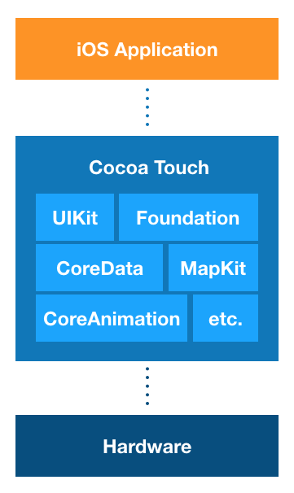
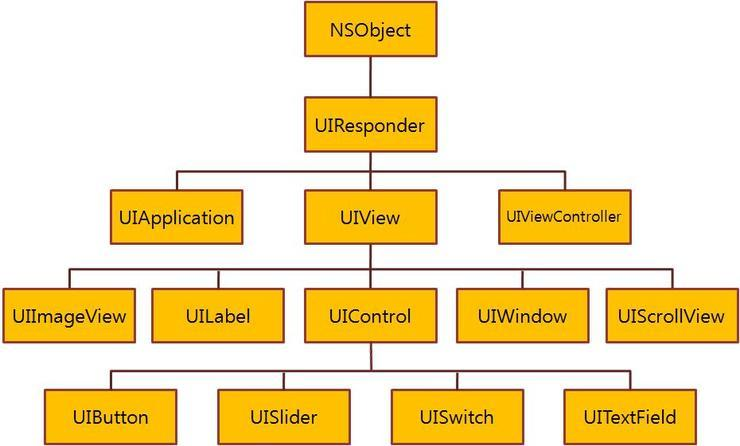

앱은 앱이 구동되기 위한 기본 구조를 제공하는 시스템 프레임워크 위에서 동작합니다.
앱 개발자는 이 시스템 프레임워크와 상호작용하는 커스텀 코드를 작성함으로써
이벤트에 어떻게 반응할지, 화면을 어떻게 구성할지, 앱 실행 중에 어떤 동작을 실행하게 할지를 결정합니다.
원하는 동작을 효과적으로 구현하기 위해서 iOS 개발자는 iOS 앱의 기본구조와 더불어 앱이 어떻게 실행되고 동작하는지 알아야합니다.  

2개에 걸친 포스트를 통해서 해당 내용을 알아보고자 합니다.

## UIKit 프레임워크
UIKit 프레임워크는 iOS 앱을 개발하기 위해 사용되는 **Cocoa Touch Framework**에 포함된 프레임워크 중 하나입니다.
Cocoa Touch Framework는 iOS의 Layer의 가장 고수준 프레임워크입니다. 
Objective-C 런타임을 기반으로하고 프레임워크 내의 모든 클래스는 NSObject를 상속받습니다.
Swift는 Cocoa Touch Framework와 완벽하게 호환되기 때문에 Objective-C를 모르더라도 Swift로 이 프레임워크를 완벽히 제어할 수 있습니다.

 

   

 

그렇다면 UIKit 프레임워크는 무엇일까요?  
이 프레임워크는 이름 그대로 앱의 화면과 UI(=User Interface), 이벤트 대응 및 화면 표시와 같은 **iOS 앱이 동작하는 구조를 정의합니다.**
이 프레임워크에 포함된 클래스들은 **UI** 접두사가 붙으며 모두 NSObject를 상속받게되고 앱이 동작하기 위한 구조내에서 각각의 역할을 수행하게 됩니다.

 

   

 

UIKit의 중요한 점은 **iOS 앱이 실행되고 동작하는 대부분의 로직이 UIKit에 의존한다는 점입니다.** 따라서 개발자는 UIKit이 제공하는 다양한 API를 사용함으로써 앱의 상태에 어떻게 반응할지, 이벤트에 어떻게 대응할지, 화면을 어떻게 표시할지, 백그라운드에서 어떤 동작을 수행할지 등을 정의할 수 있습니다.

## iOS 앱의 구조
iOS 앱의 구조는 **MVC & Delegate 패턴**으로 이루어져 있습니다. 이 패턴을 통해서 iOS 앱은 화면, 데이터, 비즈니스 로직(`업무에 필요한 데이터처리를 수행하는 응용프로그램의 일부로, 보이는 것의 뒤에서 일어나는 각종 처리를 의미`)으로 나뉘게 됩니다. 패턴의 특징 덕분에 하나의 iOS 앱이 서로 다른 디바이스에서도 동일한 동작을 실행할 수 있습니다.

아래는 iOS 앱의 기본구조 다이어그램으로 각 컴포넌트가 무엇이고 어떤 역할을 하는지 알아보겠습니다.

 

   

 

**UIApplication Object**  
UIApplication은 앱의 **Main EventLoop(=RunLoop)**를 실행시키고 Loop로 들어오는 다양한 이벤트가 적절하게 처리될 수 있도록 앱의 초기 라우팅을 처리합니다. 일반적인 유저 이벤트 뿐만 아니라 앱의 상태변화, 푸시 이벤트 처리, 앱 상태복원 작업 등 앱에서 발생하는 이벤트를 전반적으로
처리해주는 매우 중요한 객체이며, 특별한 케이스를 제외하고 앱은 1개의 UIApplication 객체만을 갖기 때문에 싱글턴으로 생성되어 shared로 앱 전역에서 접근이 가능하도록 설계되어있습니다.

> EventLoop(=RunLoop)란, 소켓, 파일, 키보드 마우스 등의 입력 소스를 처리하는 이벤트 처리 루프이며 Timer의 이벤트도 처리하는 객체입니다. RunLoop는 메인 쓰레드를 포함한 모든 쓰레드에서 가질 수 있으며, 메인 쓰레드를 제외한 각 쓰레드에서는 RunLoop를 직접 얻어서 실행시켜주어야합니다.

 

**Application Delegate Object**  
Application Delegate(=AppDelegate) 객체는 개발자가 작성한 커스텀 코드의 핵심입니다. 앱이 종료될때까지 UIApplication 객체와 연결되어 시스템과의 상호작용(앱의 시동, 상태변화 및 고차원의 앱 이벤트 등)을 처리합니다. AppDelegate는 말그대로 **App의 일부 역할을 위임(delegate)받아 동작하는 객체**이며, UIApplication이 전달해주는 시스템의 런타임 이벤트에 대하여 AppDelegate가 어떤 처리를 할 것인지 정의함으로써 개발자가 앱의 실행에 부분적으로 관여할 수 있도록 해줍니다. AppDelegate는 앱 내에서 오직 1개만 존재하게 됩니다.

 

**Document와 Data Model Objects**  
Data Model 객체는 앱의 내용(컨텐츠)을 저장하고 앱의 고유성을 가집니다. 예를 들어 은행관련 앱은 금융 거래를 포함하는 데이터베이스를 저장하게 되고 드로잉 앱은 이미지 객체 또는 이미지 생성 명령어들을 저장합니다. 앱은 데이터 모델 객체의 일부 또는 전부를 관리하기 위하여 Document 객체(UIDocument의 커스텀 서브클래스)를 사용합니다. Document 객체는 필수는 아니지만, 하나의 파일 또는 파일 꾸러미에 소유될 수 있도록 데이터를 그룹짓기에 편리한 방법을 제공합니다.

 

**View Controller Object**  
ViewController 객체는 view의 계층구조 집합을 관리하고 앱의 컨텐츠를 화면에 보여주는 역할을 합니다. 화면에 view가 보여지는 것은 ViewController가 앱의 UIWindow에 view를 추가하는 방식으로 동작합니다. UIKit의 UIViewController 클래스는 모든 ViewController 객체들의 부모 클래스이며 view를 로드 및 표시하고, UIWindow와 연결되어 오리엔테이션 변경이나 키보드 노출과 같은 이벤트에 대응하는 것 뿐만 아니라 몇몇 표준 시스템 행위를 하는 등의 기본 기능을 제공합니다.

 

**UIWindow Object**  
UIWindow는 여러 개의 View들을 담는 컨테이너 객체입니다. UIWindow는 시각적으로 보이지 않지만 하나 또는 여러개의 View를 포함하여 화면에 표시하는 것을 조정합니다. UIWindow는 하나의 화면당 1개씩 필요하기 때문에 Multi-window를 사용하지 않는다면, 보통 앱에서 1개의 UIWindow만 생성하여 사용하게 됩니다. 앱에 표시되는 컨텐츠를 변경하기 위해서는 UIWindow를 대체하지않고, ViewController를 사용하여 UIWindow에 표시되는 View를 변경합니다. 또한 UIWindow는 UIApplication 객체와 함께 앱에서 발생하는 이벤트를 View, ViewController에게 전달합니다.

 

**Views and UI Objects**  
Views and UI Objects는 앱의 컨텐츠에 대한 시각적 표현을 제공합니다. 하나의 View는 지정된 직사각형 공간에서 컨텐츠를 표현하는 객체이며 또한 그 공간에서 일어나는 이벤트에 응답합니다. UIControls는 UIButton, UISlider와 같이 인터페이스 객체를 실행하는 책임을 가지는 특화된 View의 타입입니다. UIKit 프레임워크는 각기 다른 타입의 내용을 보여주기 위해서 표준 View들을 제공합니다. 또한 UIView의 서브클래싱으로 개발자가 커스텀한 View를 직접 정의 할 수도 있습니다. 앱은 View와 Control 하이라키에 Core Animation Layer를 포함 할 수도 있습니다. Layer 객체는 시각적인 내용을 나타내는 데이터 객체로, View는 내용물을 나타내기 위하여 layer 객체를 사용합니다.

 

## 앱의 이벤트와 반응 표시(Main Run Loop)
앱이 실행되는 동안 앱에서 발생하는 이벤트를 어떻게 반응하고 처리하는지 알아보겠습니다. 
아래의 그림은 화면에서 이벤트가 발생했을 때 이를 처리하는 구조를 보여줍니다.

 

   

 

유저의 이벤트가 발생하면 iOS 커널에서 해당 이벤트를 받아 UIKit으로 구성된 Port를 통해 이벤트큐에 이벤트를 추가합니다.
큐에서 하나하나씩 꺼낸 이벤트는 이벤트 소스 객체로 Main Run Loop에 전달됩니다.
Loop는 해당 이벤트를 먼저 UIApplication 객체에 전달하게되고, 이 객체는 해당 이벤트 소스를 어떻게 처리할지 결정합니다.
터치 이벤트는 보통 Main UIWindow에 전달하며 이 이벤트는 타겟 View에 보내집니다.

> UIView의 addSubView 메서드는 약 10ms 정도의 큰 리소스를 필요로 하는 메서드이기 때문에 주의해서 사용해야합니다.  

대부분의 이벤트는 Main Run Loop를 이용하여 전달이 되지만, 몇몇 이벤트는 다르게 전달이 되기도 합니다. 
AppDelegate 객체로 전달될 수도 있고 개발자가 제공하는 블록으로 전달되기도 합니다.

touch 와 remote control 이벤트와 같은 몇몇 이벤트들은 앱의 응답 객체들이 처리를 합니다. 응답 객체들은 앱의 모든 곳에 있습니다. (UIApplication 객체, view 객체, view controller 객체는 응답 객체의 모든 예시들입니다.) 대부분의 이벤트들은 특정한 응답 객체를 타겟으로 하고 있지만, 이벤트 처리가 필요한 경우 다른 응답 객체(응답 체인을 통하여)로 전달 되기도 합니다. 예를 들면, 이벤트를 처리하지 않는 view는 자신의 상위인 superview 또는 view controller로 이벤트를 전달 할 수 있습니다.
조작시에(버튼과 같은) 일어나는 touch 이벤트는 views의 많은 다른 타입에서 일어나는 touch 이벤트와는 다르게 처리가 됩니다. 전형적으로 조작이 가능한 상호작용의 수는 제한적이며, 따라서 이러한 상호작용은 action messages로 묶이거나, 적절한 목표 객체로 전달됩니다. 이러한 target-action 디자인 패턴으로 하여금, 앱에서 개발자의 커스텀 코드의 실행을 내리는데 조작 하기가 쉽도록 합니다.

UIKit 객체를 통한 거의 대부분의 상호작용이 앱을 정의하지는 않지만, 앱의 행위를 세밀히 구분짓는데에 도움을 줍니다. 예를 들면, 앱 delegate의 methods는 개발자의 커스텀 코드가 적절하게 반응 할 수 있도록 앱이 상태 변화를 할 때 이를 개발자에게 알려 줍니다.