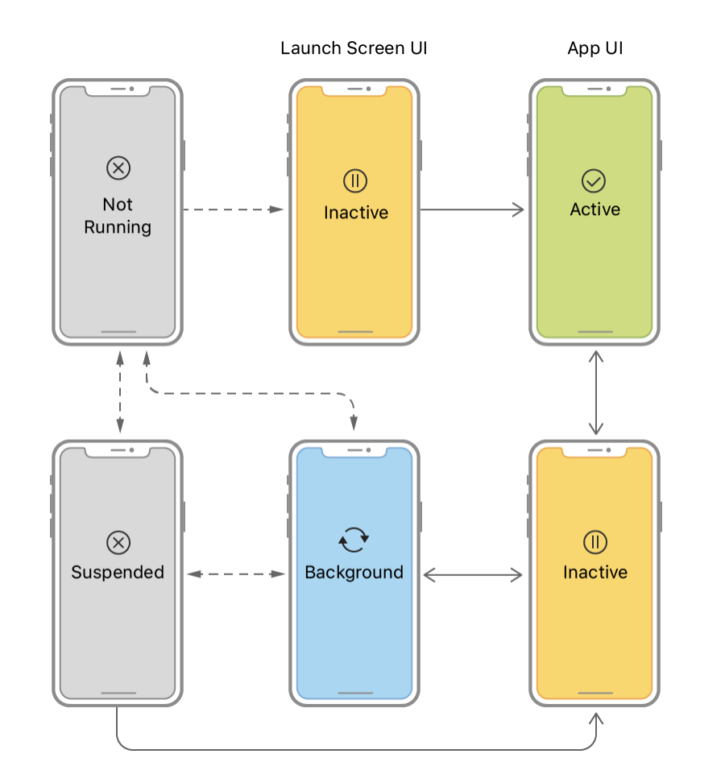
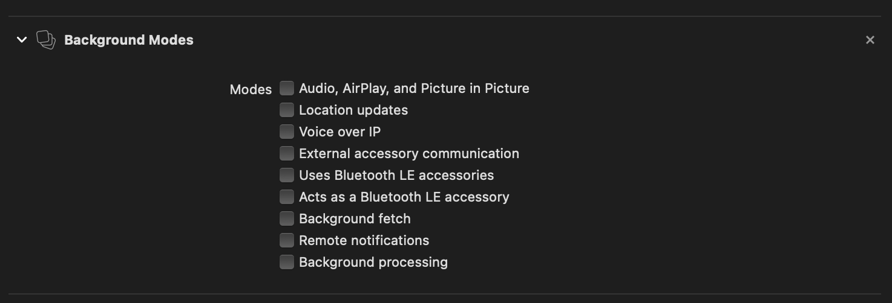

앱이 Foreground에 있을 때와 Background에 있을 때의 차이점을 알아본다.
각 상태에서 어떤 일을 할 수 있고 할 수 없는 지에 대해 파악하는 것은 실제 개발을 할 때 매우 중요하다.

## ♻️ iOS 앱 라이프사이클
iOS 13에서 Scene이 도입되면서 앱은 Scene-based 앱과 그렇지 않은 일반 앱으로 나뉜다.
그에 따라 라이프사이클 이벤트에 대응되는 객체도 UISceneDelegate, UIApplicationDelegate로 나뉘는데,
Scene에 관련된 내용은 나중에 정리하도록하고 먼저 App-based 기준으로 iOS 앱의 라이프사이클을 알아본다.

   
   <em style="font-size: 0.9em;">출처: Apple Developer</em>

 

iOS 12 이하 버전이나 Scene을 지원하지 않는 앱에서 UIKit은 모든 라이프사이클 이벤트를 UIApplicationDelegate로 전달한다.
이러한 앱 delegate는 분리된 스크린에서 보여지는 것들을 포함한 앱의 모든 window를 관리한다. 그에 따라 앱의 상태 변화는 외부 디스플레이의 컨텐츠를 포함한
앱 전체의 UI에 영향을 미친다.

위의 그림은 앱 delegate 객체와 관련된 앱의 상태 변화를 보여준다. 앱이 실행되면 시스템은 UI가 스크린에 보여지는지 아닌지 여부에 따라
앱을 Inactive나 Background 상태로 만든다. 앱이 Foreground로 시작될 때, 시스템은 자동으로 앱을 Active 상태로 바꾼다.
그 후, 앱은 Terminated 되기 전까지 Active와 Background 사이에서 변동된다.

따라서 App-based 라이프사이클에서 앱이 갖게되는 상태는 5가지로 나뉜다.

1. Not Running
2. Inactive
3. Active
4. Background
5. Suspended

#### `Not Running`
App이 실행되지 않은 상태로 App이 실행되기 전이거나 혹은 실행되었지만 System에 의해 종료된 상태

#### `Inactive(Foreground)`
App이 실행 중이지만 이벤트를 받고있지 않은 상태. Inactive에 해당되는 케이스는 아래와 같음
- 앱 실행 중 전화가 왔을 때
- 앱 실행 중 제어센터를 열었을 때
- 앱 실행 중 알림센터를 열었을 때
- 앱 실행 중 앱 스위쳐를 열었을 때
- 앱 실행 중 홈버튼을 눌러 Background 상태로 진입하기 전

#### `Active(Foreground)`
App이 실질적으로 활동하고 있는 상태로 Inactive가 아닌 Foreground 상태

#### `Background`
Foreground 상태에서 홈버튼을 누르거나 전원버튼을 눌렀을 때 실행되는 상태
- App이 Background에서 Task를 실행하고 있는 상태
- 여러 방법으로 Background에서 Task를 실행하도록 할 수 있음

#### `Suspended`
App이 Background에서 Task를 끝내고 활동을 멈춘 상태
- App의 Snapshot을 생성함. 앱 스위처를 열면 Suspended 상태의 앱 Snapshot을 확인할 수 있음
- 메모리가 부족할 때 시스템에 의해 강제종료(Not Running)될 수 있음. 강제종료 된 앱은 재실행 시, 찍어둔 Snpashot 상태로 돌아오지 않고 앱을 재실행 함

## 📘 Foreground 상태에서의 제약사항
앱의 Foreground, Background 상태가 어떤 것인지 파악했다. 이제 각 상태에서 생기는 제약사항에 대해 알아본다.

Foreground 상태의 제약사항에는 QoS가 있다.
**QoS는 Quality of Service의 약자로, 앱에서 수행하는 작업을 Service 단위로 나누어 priority를 지정하는 방법이다.**
QoS로 작업의 priority를 설정하면 해당 작업의 중요도를 시스템에 알려주게 되고, 시스템은 이에 따라 적절하게 스케쥴링을 하게 된다.
당연하게도 priority가 높을 수록 더 많은 리소스를 할당받으면서 더 빠르게 수행될 것이다. QoS에 대해서는 알아봐야 할 내용이 많기 때문에
별도의 포스트로 정리하고자 한다. 결론은, Foreground에서 수행되는 작업들에 적절한 QoS를 설정하면 더 효율적인 앱을 만들 수 있다는 것이다.

## 📗 Background 상태에서의 제약사항
Background는 아무래도 제약사항이 많을 수 밖에 없다.
시스템 상 Background에 있는 앱은 중요성이 떨어지는 앱이기 때문에 많은 리소스를 할당하지 않는다.
또한 Foreground 앱보다 낮은 우선순위를 갖기 때문에 시스템 리소스가 부족할 때 필요에 따라 강제 종료되기도 한다.

따라서 Background 상태에서 특정 작업을 실행하기 위해서는 추가적인 작업이 필요하고 그 방법에는 3가지가 있다(내가 찾아본 바로는..ㅎㅎ)

1. beginBackgroundTask, endBackgroundTask
2. Enabling Background Transfers
3. Background Modes

#### `beginBackgroundTask, endBackgroundTask`
beginBackgroundTask 메서드를 사용하면 앱이 Background에 진입하더라도 Task가 계속되도록 할 수 있다.
endBackgroundTask 메서드는 beginBackgroundTask로 시작한 Background Task가 끝났다는 것을 시스템에 알려준다.

이 방법은 보통 앱이 Suspended 상태로 진입하기 전에 Background에서 마무리해야하는 작업이 있을 때 사용한다.

중요한 점은 이 방법으로 실행되는 Task는 최대한 빠르게 마무리해야한다는 것이다. 
OS가 Background에 머무는 최대시간은 보통 3분으로 알려져 있는데(Background에서 작업이 시작되는 경우에는 30초)
이 시간에 의존적으로 코드를 작성하게되면, 추후 iOS 버전에서 앱이 정상적으로 작동하지 않을 수 있다.
따라서 최대시간에 의존하지 않고 최대한 빠르게 Task를 마무리할 수 있도록 처리하는 것이 좋다.

사용방법은 아래와 같다.
아래 코드는 Background에 머무를 수 있는 남은시간(UIApplication.shared.backgroundTimeRemaining)이
10초 이하가 될 때 Task를 끝내는 예제이다. 이렇게 Suspended 진입 전에 Task를 마무리할 수 있도록 처리하는 것이 좋다.

~~~ swift
func applicationDidEnterBackground(_ application: UIApplication) {
    var taskId: UIBackgroundTaskIdentifier = UIBackgroundTaskIdentifier(rawValue: 0)

    // 백그라운드에서도 Task를 실행
    taskId = UIApplication.shared.beginBackgroundTask {
        // 앱의 backgroundTimeRemaining이 0이 되어 expire 되는 시점에 콜백되어 실행되는 block
        print("🏄🏻‍♂️ We are about to kill your task")
        UIApplication.shared.endBackgroundTask(taskId)
        taskId = UIBackgroundTaskIdentifier.invalid
    }

    print("🏄🏻‍♂️ The task ID: \(taskId)")

    let _ = Timer.scheduledTimer(withTimeInterval: 1, repeats: true) { _ in
        let bgTimeLeft = UIApplication.shared.backgroundTimeRemaining

        // 백그라운드에서도 매 1초마다 문구 print
        print("🏄🏻‍♂️ Executing (\(bgTimeLeft) seconds remaining) in \(UIApplication.shared.applicationState.rawValue)")

        // Background에 머무를 수 있는 남은시간이 10초 이하일 때 Task 종료
        if bgTimeLeft <= 10 {
            UIApplication.shared.endBackgroundTask(taskId)
            taskId = UIBackgroundTaskIdentifier.invalid
        }
    }
}
~~~

결과 로그는 아래와 같다.

~~~ swift
// Output logs
🏄🏻‍♂️ The task ID: UIBackgroundTaskIdentifier(rawValue: 1)
🏄🏻‍♂️ Executing (1.7976931348623157e+308 seconds remaining) in 2
🏄🏻‍♂️ Executing (1.7976931348623157e+308 seconds remaining) in 2
🏄🏻‍♂️ Executing (28.88500820599984 seconds remaining) in 2
🏄🏻‍♂️ Executing (27.65431873399939 seconds remaining) in 2
🏄🏻‍♂️ Executing (26.982295269999668 seconds remaining) in 2
🏄🏻‍♂️ Executing (25.707885963999615 seconds remaining) in 2
🏄🏻‍♂️ Executing (25.067891577999944 seconds remaining) in 2
🏄🏻‍♂️ Executing (23.853501581999808 seconds remaining) in 2
🏄🏻‍♂️ Executing (22.657771845999378 seconds remaining) in 2
🏄🏻‍♂️ Executing (22.051023963999796 seconds remaining) in 2
🏄🏻‍♂️ Executing (20.838154054999904 seconds remaining) in 2
🏄🏻‍♂️ Executing (19.604446245999497 seconds remaining) in 2
🏄🏻‍♂️ Executing (18.3591678519997 seconds remaining) in 2
🏄🏻‍♂️ Executing (17.73390084499988 seconds remaining) in 2
🏄🏻‍♂️ Executing (17.107633873999475 seconds remaining) in 2
🏄🏻‍♂️ Executing (16.142702567000015 seconds remaining) in 2
🏄🏻‍♂️ Executing (15.147832347000076 seconds remaining) in 2
🏄🏻‍♂️ Executing (14.14827196799979 seconds remaining) in 2
🏄🏻‍♂️ Executing (13.147900185999788 seconds remaining) in 2
🏄🏻‍♂️ Executing (12.148157014999924 seconds remaining) in 2
🏄🏻‍♂️ Executing (11.14874903100008 seconds remaining) in 2
🏄🏻‍♂️ Executing (10.13964212799965 seconds remaining) in 2
🏄🏻‍♂️ Executing (9.140562907999993 seconds remaining) in 2
~~~

#### `Enabling Background Transfers`
일반적인 다운로드 작업은 Background로 진입할 때 멈춘다.
**하지만 이 기능을 사용하면 앱의 상태와 관계없이 다운로드가 중지되지 않고 계속 동작한다.**

앱이 실행 중이지 않음에도 다운로드 작업을 할 수 있는 이유는 앱 외부에 존재하는 **Daemon** 때문이다.
OS는 Background 전송 작업을 관리하기 위해 이 Daemon을 실행하는데, 다운로드 작업을 실행할때 앱에 적절한 delegate 메시지를 보낸다.
전송중에 앱이 종료되는 경우, 그 작업은 Background에서 계속 실행된다.

다운로드가 완료되면 Daemon은 Background에서 앱을 재실행시키고, 이렇게 재실행된 앱은 똑같은 세션에 재연결한 뒤 completion delegate 메시지를 받아 필요한 작업(e.g. 다운로드한 파일을 영구적인 위치에 저장)을 수행한다.

하지만 앱 스위처에서 유저가 앱을 강제종료하면 시스템은 세션을 취소하고 앱을 재실행하지 않는다. 구현방법은 [링크](https://devmjun.github.io/archive/URLsession)로 대체한다.

#### `Background Modes`
Apple에서 지원하는 Background Mode를 사용하는 방법이다. UIBackgroundModes key를 plist에 등록하여 특정 모드를 사용할 수 있다.
Xcode 앱의 Capabilities에서 사용 가능한 Background Mode 리스트를 확인할 수 있다.

 

   

 

## 🧑🏻‍💻 결론
앱의 라이프사이클에 따른 각 상태와 Foreground, Background 상태의 제약사항을 확인했다.
어떤 제약사항이 있으며 해당 제약사항에 대한 대응법이 무엇인지 알게 되었으니, 이에 대한 이슈가 생길 때 해결방법에 조금 더 빠르게 다가갈 수 있을 것 같다. 
알아보는 재미가 있었다.

## 🔗 레퍼런스
- [https://hamait.tistory.com/715](https://hamait.tistory.com/715])
- [https://devmjun.github.io/archive/URLsession](https://devmjun.github.io/archive/URLsession)
- [https://developer.apple.com/documentation/uikit/uiapplication/1623031-beginbackgroundtask](https://developer.apple.com/documentation/uikit/uiapplication/1623031-beginbackgroundtask)
- [https://www.andyibanez.com/posts/background-execution-in-ios/](https://www.andyibanez.com/posts/background-execution-in-ios/)
- [https://devmjun.github.io/archive/URLsession](https://devmjun.github.io/archive/URLsession)